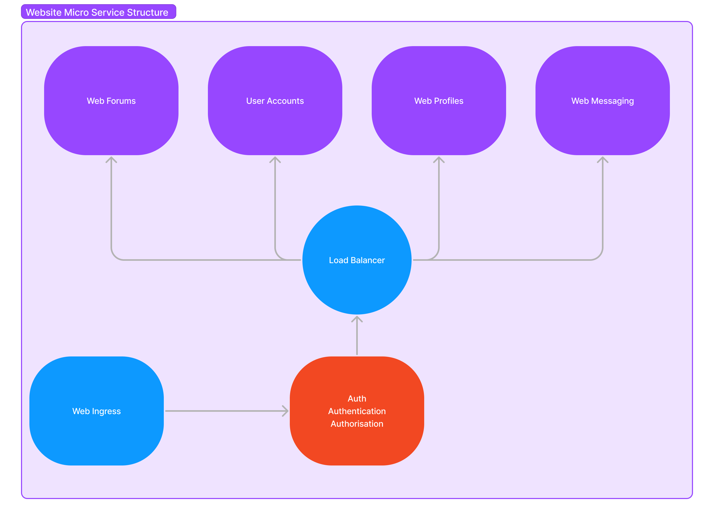

# web-forum
A project to learn about implementing micro services in Go. This project contains the code to provide the backend for the forums of a website. 

# Project
The project as a whole is a website with a collection of micro services that make up the whole website service. 

## Environment Variables
This service accepts the following variables to add custom configuration to the http/https server.
| Variable | Description | Default Value |
| -------- | ----------- | ------------- |
| SERVER_PORT | Pass a custom integer value port. | 3000 |
| SERVER_TLS | Boolean value to enable TLS/SSL, must be set to true to take in server cert and key. | false |
| SERVER_KEY | Provide a path to the server key, if SERVER_TLS is set to true you must pass a valid path to key. | N/A |
| SERVER_CERT | Provide a path to the server cert, if SERVER_TLS is set to true you must pass a valid path to key. | N/A |
